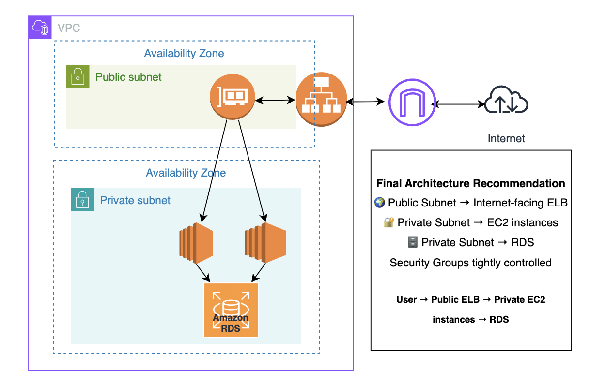

❓ If you have 3 web server instances and one goes down… should users change the domain name or IP address to access another instance?
Imagine telling your users:

 “Hey, server-1 is down, please use this new IP address.” 😅
That’s not scalable. That’s not reliable. That’s not cloud architecture.

💡 The Solution? Elastic Load Balancing (ELB).

In Amazon Web Services, an Elastic Load Balancer distributes traffic across multiple resources — so users never need to remember multiple IPs or domains.
Users only access:
➡️ The Load Balancer DNS name (endpoint)
And the Load Balancer handles the rest.

🔎 What Does a Load Balancer Do?
Distributes traffic across multiple EC2 instances
Performs health checks
Automatically stops sending traffic to unhealthy instances
Improves availability & fault tolerance

🚦 Types of Load Balancers in AWS
1️⃣ Classic Load Balancer (CLB)
First-generation load balancer
Limited features
Not recommended for modern architectures

2️⃣ Application Load Balancer (ALB)
Operates at Layer 7 (Application Layer)
Supports HTTP / HTTPS / WebSockets
Performs application-specific health checks
Can route based on:
Domain name (host-based routing)
URL path (path-based routing)
Supports SSL/TLS termination (decrypts traffic before forwarding to instances)
Best for: Web applications & microservices.

3️⃣ Network Load Balancer (NLB)
Operates at Layer 4 (Transport Layer)
Handles TCP/UDP traffic
Extremely high performance & low latency
Basic TCP health checks
Does NOT decrypt traffic (encryption handled at the instance)
Best for: Non-HTTP workloads & high-performance applications.

⚙️ How It Works
You select subnets in different Availability Zones.
AWS deploys Load Balancer nodes into those subnets.
A DNS name is automatically created for the Load Balancer.
Traffic is distributed across:
Load Balancer nodes
Then forwarded to healthy EC2 instances
🟢 One Load Balancer node per AZ subnet
🟢 Optional: Cross-zone load balancing for even traffic distribution

🌍 Public vs Private Load Balancer
Public Load Balancer - Deployed in public subnets, Accessible from the internet
Private Load Balancer- Deployed in private subnets, Used internally within the organization network

🔐 Architecture Recommendation
Traditionally:
Web servers → Public subnet
Databases → Private subnet

But with ELB:
 You can deploy:
✅ Load Balancer in public subnet
✅ Web servers in private subnets

Users access only the Load Balancer endpoint — Your EC2 instances stay private.
That’s cleaner. That’s more secure. That’s production-ready architecture.

