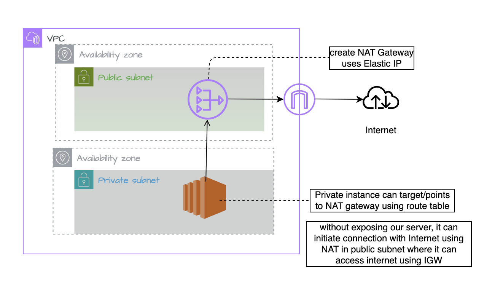

👉 𝗛𝗼𝘄 𝗖𝗮𝗻 𝗮 𝗣𝗿𝗶𝘃𝗮𝘁𝗲 𝗦𝗲𝗿𝘃𝗲𝗿 𝗔𝗰𝗰𝗲𝘀𝘀 𝘁𝗵𝗲 𝗜𝗻𝘁𝗲𝗿𝗻𝗲𝘁 𝗳𝗼𝗿 𝗨𝗽𝗱𝗮𝘁𝗲𝘀 & 𝗣𝗮𝘁𝗰𝗵𝗲𝘀? 🤔
We’re done with 𝗩𝗣𝗖, 𝗦𝘂𝗯𝗻𝗲𝘁𝘀, 𝗥𝗼𝘂𝘁𝗶𝗻𝗴, and 𝗜𝗻𝘁𝗲𝗿𝗻𝗲𝘁 𝗚𝗮𝘁𝗲𝘄𝗮𝘆.
Now let’s deep dive into something critical in real-world AWS architecture — 𝗡𝗔𝗧 𝗚𝗮𝘁𝗲𝘄𝗮𝘆 🚀

🚨 𝗧𝗵𝗲 𝗣𝗿𝗼𝗯𝗹𝗲𝗺
A server inside a private subnet needs internet access for:
 • OS updates
 • Security patches
 • Installing packages
But… we don’t want the internet to initiate connections to that server.
So how do we solve this? 🤔

✅ 𝗧𝗵𝗲 𝗦𝗼𝗹𝘂𝘁𝗶𝗼𝗻 — 𝗡𝗔𝗧 𝗚𝗮𝘁𝗲𝘄𝗮𝘆
NAT performs source network address translation (SNAT) — it replaces the private IP with its Elastic IP when sending traffic to the internet.

A NAT Gateway is deployed in a public subnet.
That means:
 • It has a public IP
 • It can access the internet
 • It acts as an intermediary
Traffic flow looks like this:
Private EC2 → NAT Gateway → IGW → Internet
Important:
The internet cannot initiate a connection back to the private instance because it does not have a public IP. This is called 𝗢𝘂𝘁𝗯𝗼𝘂𝗻𝗱 𝗜𝗻𝘁𝗲𝗿𝗻𝗲𝘁 𝗢𝗻𝗹𝘆 𝗔𝗰𝗰𝗲𝘀𝘀 🔐

🔄 𝗛𝗼𝘄 𝗜𝘁 𝗪𝗼𝗿𝗸𝘀
1️⃣ Create VPC
2️⃣ Create Public & Private Subnets
3️⃣ Attach IGW to VPC
4️⃣ Public route table → any IP → IGW
5️⃣ Deploy NAT Gateway in Public Subnet
6️⃣ Private route table → any IP → NAT Gateway
Now your private servers can access internet safely.

🚀 NAT requires:
Elastic IP
Must be placed in public subnet
Public subnet must have route to IGW
Without IGW, NAT won’t work.
That dependency is very important.

💰 𝗣𝗿𝗶𝗰𝗶𝗻𝗴 𝗥𝗲𝗺𝗶𝗻𝗱𝗲𝗿
NAT Gateway is charged:
 • Per hour
 • Per GB of data processed
Architecture is always a balance between:
 Security 🔐
 Availability 🌍
 Cost 💰

⚖️ 𝗡𝗔𝗧 𝗚𝗮𝘁𝗲𝘄𝗮𝘆 𝘃𝘀 𝗜𝗚𝗪 (main difference)
• IGW is region-resilient
• NAT Gateway is AZ-specific
If an AZ goes down → NAT in that AZ goes down too.
For high availability, deploy NAT in multiple AZs. But remember — cost increases.

Cloud is not just about creating resources.
It’s about designing smartly.

