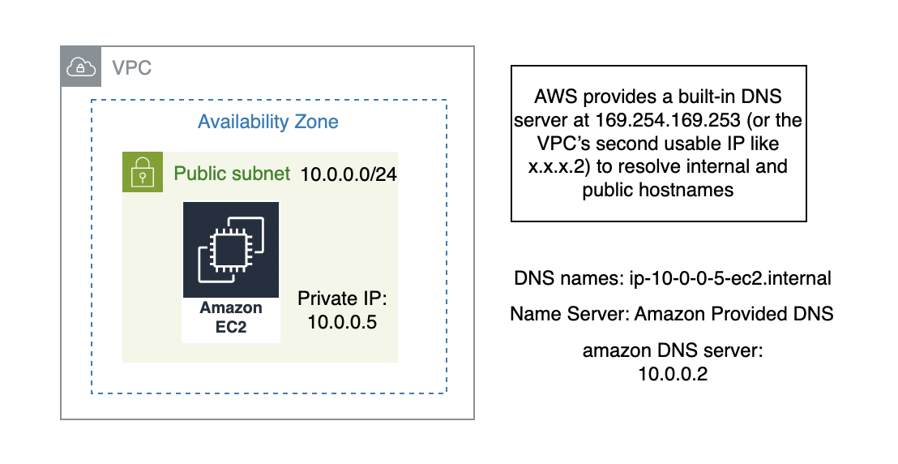

𝗘𝘃𝗲𝗿 𝘄𝗼𝗻𝗱𝗲𝗿 𝗵𝗼𝘄 𝗘𝗖𝟮 𝗶𝗻𝘀𝘁𝗮𝗻𝗰𝗲𝘀 𝗿𝗲𝘀𝗼𝗹𝘃𝗲 𝗲𝗮𝗰𝗵 𝗼𝘁𝗵𝗲𝗿 𝗶𝗻𝘀𝗶𝗱𝗲 𝗮 𝗩𝗣𝗖 𝘄𝗶𝘁𝗵𝗼𝘂𝘁 𝗲𝘅𝗽𝗼𝘀𝗶𝗻𝗴 𝗽𝗿𝗶𝘃𝗮𝘁𝗲 𝗜𝗣𝘀? 🤔

𝗗𝗡𝗦 – 𝗗𝗼𝗺𝗮𝗶𝗻 𝗡𝗮𝗺𝗲 𝗦𝘆𝘀𝘁𝗲𝗺
 Instead of remembering IP addresses, we use domain names.
Inside an Amazon VPC:
• Every EC2 instance with a private IP automatically gets a private DNS hostname
👉 something like: private-ip.ec2.internal

𝗛𝗼𝘄 𝗱𝗼𝗲𝘀 𝗗𝗡𝗦 𝘄𝗼𝗿𝗸 𝗶𝗻 𝗮 𝗩𝗣𝗖?
AWS provides a built-in DNS server that we can use.
You can send DNS queries to:
1️⃣ 169 .254 .169 .253 (AWS-provided DNS server)
 OR
2️⃣ The second usable IP of your VPC CIDR block
 👉 Example: if VPC CIDR is x.x.x.0/16, DNS server will be x.x.x.2
You can verify this inside your EC2 instance:
cat /etc/resolv.conf. => You’ll see the DNS server pointing to the VPC’s second IP (x.x.x.2).

𝗜𝗺𝗽𝗼𝗿𝘁𝗮𝗻𝘁 𝗗𝗡𝗦 𝗦𝗲𝘁𝘁𝗶𝗻𝗴𝘀 𝗶𝗻 𝗩𝗣𝗖
There are two main options:
1️⃣ DNS Resolution
- Must be enabled
- Allows instances to resolve domain names
⚠️ Without enabling this, instances cannot properly resolve DNS names.
2️⃣ DNS Hostnames
- Needed if you want public DNS names for instances with public IPs
- By default, private DNS is assigned
- Public DNS hostname is only assigned when this option is enabled

So next time when your instances communicate using hostnames instead of IP addresses — remember there’s an AWS-managed DNS quietly working behind the scenes 😉

Did anyone notice or had a doubt that the instance private IP or public IP has DNS names which expose IP address in it?
Yes ✅ — the private IP is embedded in the hostname.
But here’s the key:
🔒 That instance IP DNS name is only resolvable inside the VPC
🌍 It is NOT accessible from the public internet
DNS becomes powerful with Route 53 and Load Balancers.(will talk about in later). 

