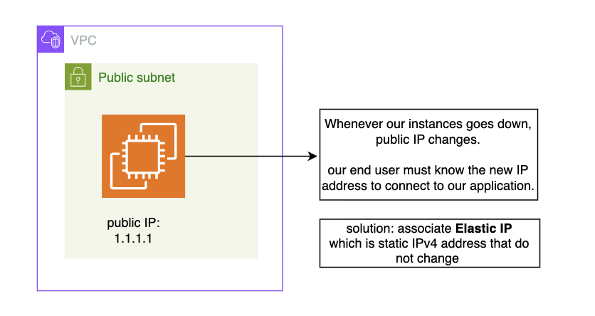

𝗪𝗵𝗮𝘁 𝗶𝘀 𝗮𝗻 𝗘𝗹𝗮𝘀𝘁𝗶𝗰 𝗜𝗣? 🤔
𝗔𝗻𝗱 𝘄𝗵𝘆 𝗱𝗼 𝘄𝗲 𝗻𝗲𝗲𝗱 𝗶𝘁 𝗶𝗳 𝘄𝗲 𝗮𝗹𝗿𝗲𝗮𝗱𝘆 𝗵𝗮𝘃𝗲 𝗽𝘂𝗯𝗹𝗶𝗰 𝗮𝗻𝗱 𝗽𝗿𝗶𝘃𝗮𝘁𝗲 𝗜𝗣𝘀?
If this question ever came to your mind — let’s understand it clearly 👇

🚨𝗧𝗵𝗲 𝗣𝗿𝗼𝗯𝗹𝗲𝗺
Users can connect to your server/application only if it has a public IP address.
But here’s the catch ⚠️
If an EC2 instance:
- Stops
- Is terminated
- Or is replaced
👉 It gets a new public IP address.
That means:
- Your application endpoint changes
- Users must be informed
- DNS needs updating
- Monitoring becomes necessary
- This creates operational headaches.

✅ 𝗧𝗵𝗲 𝗦𝗼𝗹𝘂𝘁𝗶𝗼𝗻 → 𝗘𝗹𝗮𝘀𝘁𝗶𝗰 𝗜𝗣
An Elastic IP (EIP) is:
✔ A static public IPv4 address
✔ Reserved for your AWS account
✔ Specific to a region
✔ Allocated first, then associated to an instance

It comes from Amazon’s public IPv4 pool (or you can even bring your own IP range).

Now even if:
The instance stops
The server is replaced
👉 You can re-associate the same Elastic IP
👉 No change from the user’s perspective
Problem solved ✅

𝗕𝗶𝗴 𝗔𝗱𝘃𝗮𝗻𝘁𝗮𝗴𝗲
Let’s say your server goes down for maintenance.
Instead of informing users about a new instance & new IP:
👉 Launch a new instance for your application.
👉 Associate the same Elastic IP to the new instance.
Traffic automatically redirects.

𝗣𝗿𝗶𝗰𝗶𝗻𝗴 𝗕𝗿𝗲𝗮𝗸𝗱𝗼𝘄𝗻
💰 If Elastic IP is associated with a running instance → No extra charge
💰 If you attach multiple Elastic IPs to the same instance → Additional charges per IP/hour
💰 If Elastic IP is allocated but NOT associated with any instance → Small hourly charge applies
(AWS encourages efficient usage of public IPv4 addresses.)

TL;DR:
• Elastic IP is static
• It is region-specific
• You must allocate first, then associate
• Helps avoid public IP changes
• Supports failover and instance replacement

To understand Elastic IP service we examined application instance, But In modern architectures, many production systems prefer:
Load Balancers & DNS-based routing

𝗘𝗹𝗮𝘀𝘁𝗶𝗰 𝗜𝗣 𝗵𝗲𝗹𝗽𝘀 𝘄𝗶𝘁𝗵 𝘀𝘁𝗮𝘁𝗶𝗰 𝗮𝗱𝗱𝗿𝗲𝘀𝘀𝗶𝗻𝗴, 𝗯𝘂𝘁 𝗟𝗼𝗮𝗱 𝗕𝗮𝗹𝗮𝗻𝗰𝗲𝗿𝘀 𝗮𝗻𝗱 𝗗𝗡𝗦 𝗵𝗲𝗹𝗽 𝘄𝗶𝘁𝗵 𝘀𝗰𝗮𝗹𝗮𝗯𝗶𝗹𝗶𝘁𝘆 𝗮𝗻𝗱 𝗿𝗲𝘀𝗶𝗹𝗶𝗲𝗻𝗰𝗲.
Elastic IP is powerful, usually used for:
Bastion hosts (fixed SSH entry point)
NAT gateways
Static endpoints

