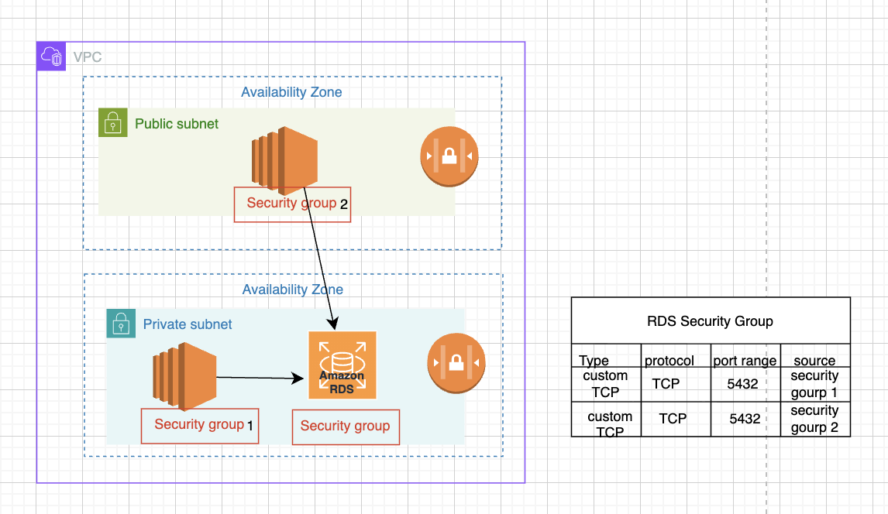

🔐 How Are Our Subnets and EC2 Instances Actually Secured?

“We made the subnet private using NAT Gateway. We attached an Internet Gateway. So we’re secure… right?”
Not exactly. 😌

IGW and NAT Gateway control internet connectivity —
But they do NOT secure your internal network.
So how do we:

• Stop unwanted ports from reaching our subnet?
• Prevent unauthorized access to EC2?
• Secure databases from public exposure?
• Protect the overall VPC network?

Let’s deep dive into Security Groups and Network ACLs (NACLs).

🧱 Before Jumping Into NACLs & Security Groups…
First, understand two important firewall concepts:
🔄 Stateless vs Stateful Firewalls

🟠 Firewall Rules
Firewalls protect traffic to and from specific resources.
They have:
Inbound rules
Outbound rules

🟥 Stateless Firewall
No intelligence.
It only checks rules exactly as defined.
If you allow inbound traffic, you must explicitly allow outbound response too.
There is no memory of connection state.

🟢 Stateful Firewall
Intelligent firewall.
It remembers connections (maintains session information).
If a request is permitted, the response is automatically allowed.
You only need to define the rule in one direction (usually inbound).

🌐 Network ACLs (NACLs) – Subnet Level Firewall
NACLs operate at the subnet level.
Key Points:
• Filters traffic entering and leaving the subnet
• Does NOT filter traffic within the same subnet
• Stateless → Must configure both inbound AND outbound rules
• Supports both Allow and Deny rules
• One NACL can be associated with multiple subnets
• One subnet can only have one NACL at a time
• Rules are evaluated by priority number (lowest number = highest priority)
• First matching rule is applied

🔒 Security Groups – Resource Level Firewall
Security Groups work at the resource level:
EC2, RDS, Load Balancers etc.,
Key Points:
• Stateful firewall
• Only need to allow request direction (response is automatic)
• Only supports ALLOW rules (no explicit deny)
• Multiple Security Groups attached to a resource → rules are merged

🎯 Real-Time Practical Use Case (Debug Story 👩‍💻)
In one of my previous organizations, I resolved a production connectivity issue where the web server was failing to establish a connection with the database.
Scenario:
We created a Security Group for an RDS instance (PostgreSQL).
Port: 5432 (default PostgreSQL port)
Now the question:
How do we allow access only from the web server?
Instead of:
Adding the private IP of the EC2 instance
✅ The better solution:
Use the Security Group of the web server as the source in the RDS Security Group.
This way:
No need to track IP addresses
More scalable
Cleaner architecture
More secure

